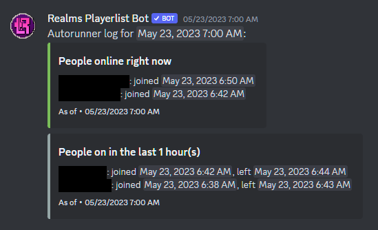
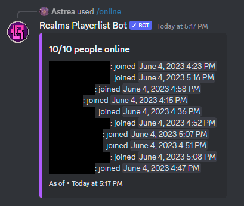
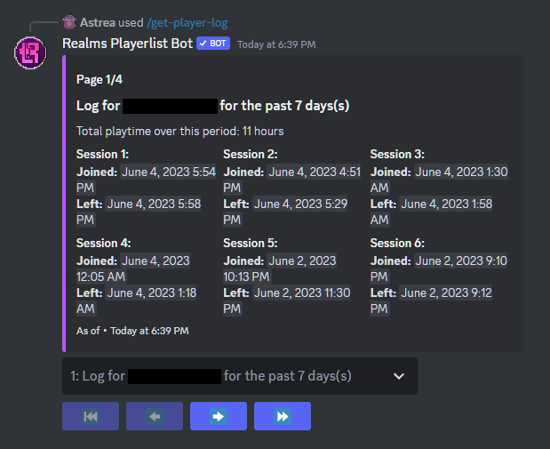
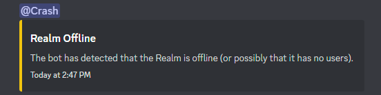
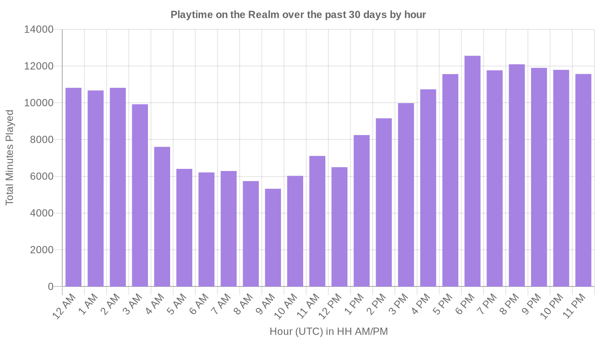
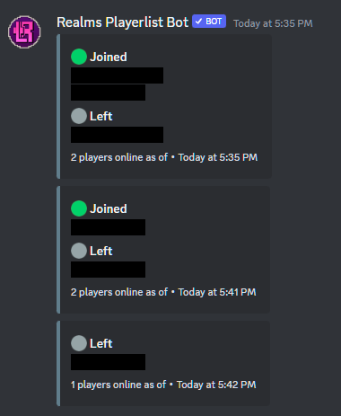
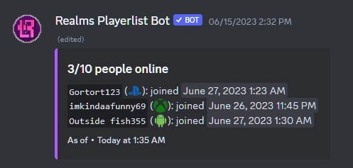

<figure markdown>
  { width="700"}
</figure>

  
  
  
  

  A bot that helps out owners of Minecraft: Bedrock Edition Realms by showing various statistics related to player join/leaves.

It's:
- 🚀 **Fast:** Under the right (and typical) circumstances[^1], it can generate a list of ~300 players in under *4 seconds,* 3-3.5 of which is only due to Discord's rate limits.[^2]
- 📊 **Informative:** The main feature of the bot, the playerlist, can give a detailed log of players on a Realm at a moment's notice. You can also get a breakdown for an individual player to analyze as you wish.[^3]
- 👌 **Easy to Use**: Simply add the bot, link your Realm, and you already have join/leave tracking enabled - no need to sign into and use an Xbox account. Take a look at the [Server Setup Guide](wiki/server_setup) for more information.
- 🔓 **Open Source**: The code is available to the public and able to be audited and learned from. Dedicated users can even (try to[^4]) self-host the bot, if they wish.

## Features

### The Playerlist
Of course, this is the main feature of the bot. It's also one of those features that is easier to show than tell:

<figure markdown>
  { width="550" loading="lazy" }
  <figcaption>The censored space are gamertags of users on the Realm.</figcaption>
</figure>

The command version allows you to get who was on the Realm up to the last 24 hours (though it defaults to 12 hours). There is also an automatic version that runs every hour in a specified channel (as seen in the picture) - it displays a list going back an hour, every hour.

The command can normally only be run by people with Manage Server permissions (can be adjusted the same way you adjust other slash command permissions[^5]) and is not meant to be seen by normal people. However, normal users, by default, can run `/online`, which shows everyone who is on the Realm at that moment:

<figure markdown>
  { width="450" loading="lazy"}
</figure>

### Specific Player Information

You can also request for a breakdown of join/leaves (otherwise known as sessions) via `/get-player-log`:

<figure markdown>
  { width="550" loading="lazy"}
</figure>

Using this command allows you to scroll through each session in an intuitive format. For fun, the command also displays their total playtime.

By default, the command only goes back a day, but it can go till 7, as seen here.

### Realm Offline Notifications

Realms go offline a lot if they're big, most likely because they can't handle the load. Sometimes, it can be useful to get pinged when that happens:

<figure markdown>
  { loading="lazy" }
  <figcaption>Note: despite the role name used, this does not exclusively trigger when the Realm crashes.</figcaption>
</figure>

This simply hooks onto your autorunning playerlist. The Realm offline detection is mostly accurate[^6] - it may not work as well for smaller Realms, but for larger ones, it should work fine.

### Graphs

You can make cool graphs about your Realm and its users:

<figure markdown>
  { width="550" loading="lazy"}
</figure>

There are a variety of options to chose from, from the graph up above to a day-to-day breakdown. The data isn't 100% accurate, but you can use it to observe patterns... or just show it off for fun.

Free users have limited options that only go back 7 days at most. Premium users can go all the way back to 30 days and have more options for data to graph.

### Premium

**Realms Playerlist Premium** allows for extra features that otherwise could not be provided by the bot without funding. [Take a closer look at Premium here.](wiki/premium)

#### Live Playerlist

Instead of making the bot send a summary of people on every hour, a **live playerlist** shows who joined and left a Realm every minute, basically making it a live join/leave logger.

It looks something like this:

<figure markdown>
  { width="420" loading="lazy"}
</figure>

This has a variety of uses, from statistical to moderation - it's really up to you what you do with this information. Some Realms use it both to narrow down subjects to a precise degree while also tracking active Realm times. Using Discord's search functionality, the possibilities are near endless.

#### Live Online List

Taking the live playerlist to its logical conclusion, a **live online list** is a message that constantly updates with the players currently on the Realm, as seen below:

<figure markdown>
  { width="500" loading="lazy"}
</figure>

As of right now, this feature requires the live playerlist to also be enabled.

#### Device Information

Through an extra toggle, the bot can fetch and display device information whenever a user is online. This affects `/online`, the normal playerlist, and the live playerlist.

For example, `/online` becomes this:

<figure markdown>
  { width="420" loading="lazy"}
</figure>

This does slow the bot down a bit when fetching the device[^7], and privacy settings may make some users not have information regardless[^8], but can used as an extra moderation/statistical tool.

#### More Options For Graphs

As mentioned earlier, free users can only go back 7 days for their graphs, and have limited options on how it can be graphed. With Premium, users can go back 30 days and graph in a variety of ways.

## Adding The Bot

If you wish to add this bot, just [use the Server Setup Guide on how to do so](wiki/server_setup). It'll give a basic rundown on how to set up the bot, as well as showing how to set basic options.

## FAQ

There's a whole section in the wiki about this! [Check it out here](wiki/faq).

[^1]:
    The bot relies on a cache to speed up certain parts of the playerlist - there's a rare chance that the bot's cache doesn't have any useful information in it when
    the playerlist is generated, but... well, it's rare because the bot caches a lot quickly.
[^2]:
    Admittedly, the test used to determine this wasn't very scientific, but the actual number for the speed of the playerlist is likely *lower*, not higher.
    Essentially, I measured the time until the bot sends the first part of the calculated playerlist, which is both the time it takes for the bot to calculate it
    *and* the time for the bot to make a web request to Discord to actually send the message (adding a considerable delay). The ratelimits come in when sending every
    part of the playerlist (as a list that big will not fit in one message) - the bot sleeps 0.2 seconds between messages to try not to trigger them, and Discord can
    still trigger them anyways, forcing the bot to wait longer. This test was also done with an old version which split the playerlist into shorter pieces than it should have.
[^3]: Through `/get-player-log`.
[^4]: This bot is *hard* to self-host due to the number of things it uses. Check out [this FAQ question](wiki/faq.html#can-i-self-host-this) for more information.
[^5]: https://support.discord.com/hc/en-us/articles/4644915651095-Command-Permissions
[^6]:
    As the name of the feature suggests, it detects when your Realm goes *offline* - more accurately, it detects when the bot can't detect the Realm.
    This does mean it can trigger if the bot is accidentially kicked or banned, or just because Minecraft decided to freak out for a few minutes.
[^7]: This requires bypassing certain parts of the bot (its cache) to get up-to-date information, hence the slowdown.
[^8]: If users are offline on Xbox Live, their device won't appear. There may be settings that also make the user not share their current game details.
